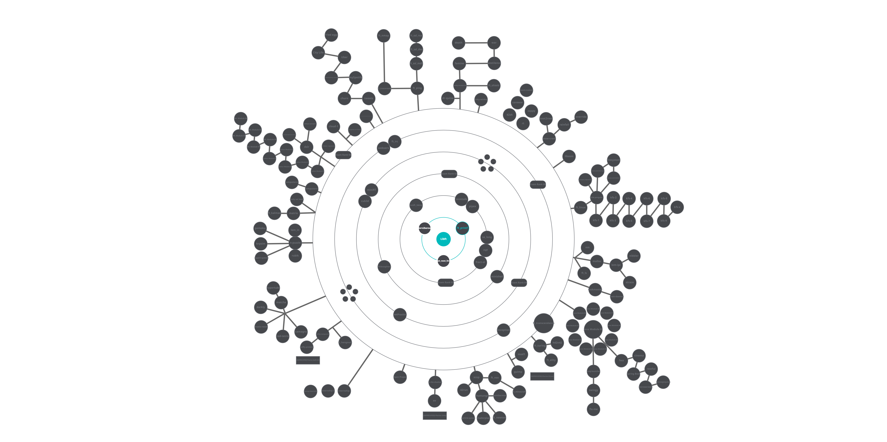

## 42cursus

	<b>Projects developed at <a href="https://1337.ma/en/">1337</a> programming school.</b> 

	
<!--  -->

This repository contains my projects for the 42 Cursus, a programming curriculum developed by 42 Paris. The 42 Cursus is an intensive, peer-to-peer learning program designed to teach computer science and programming skills through project-based learning. Each project is graded by peers using a peer-evaluation system called "correction," and successful completion of each project is required to progress to the next level of the program.

<h2> About 42 </h2>

42 is a global education initiative that offers a new way of learning technology:
no teachers, no classrooms, students learning from their fellow students (peer to peer learning), with a methodology that develops both computing and life skills. The 42 cursus is free for whoever is approved in its selection process* - the so-called "Piscine" - becoming thus "cadets" (42's students).

\* For further information about 42's **selection process** (the "Piscine"), please visit the [C Piscine repo](https://github.com/zakelh6/42Piscine-C).

<h2>42's galaxy (curriculum)</h2>

**42cursus** comprises two groups of projects: the first one being known as _"inner circle"_ and the second one, _"outer treks"_ - due to the **Holy Graph** layout (see image below).

The **inner circle** is the basic curriculum, with all projects being mandatory to attain level 7 - which is the minimum level required for activities such as internships and interchange.

The **outer treks** is a collection of diverse project trails in subjects ranging from operational systems to web development which allows cadets to specialize on whatever subject they prefer.

The table below presents the cursus curriculum in the chronological order in which it was (or is to be) completed by me - projects order and corresponding attained level may vary among students.

## Projects

|CIRCLE	|PROJECT	| DESCRIPTION |TECHNOLOGY	|STATUS	|
|:-:	|:--		|:--	|:--				|:-:	|
|00	|[Libft](https://github.com/zelhajou/libft)| A library of useful C functions	|C	|✅ 122 	|
|:dizzy:|	:dizzy:	|	:dizzy:	|	:dizzy:	|:dizzy:	|:dizzy:	|
|01	|[ft_printf](https://github.com/zelhajou/ft_printf)|A function that mimics the behavior of the C library printf function|C|✅  100 |
|02	|[Born2beroot](https://github.com/zelhajou/Born2beRoot)| A project on Virtualization basics 	|VM, debian|✅  108|
|03	|[get_next_line](https://github.com/zelhajou/get_next_line)| A function that reads a file line-by-line 	|C|✅  125|
|:dizzy:|	:dizzy:	|	:dizzy:	|	:dizzy:	|:dizzy:	|:dizzy:|
|04	|[push_swap](https://github.com/zelhajou/push_swap)| A program that sorts a stack of numbers using a minimal set of operations |C|✅ 125|
|05	|[minitalk](https://github.com/zelhajou/minitalk)| A communication program that uses UNIX signals to exchange data between a client and a server. |C| ⏳|

## Skills developed at 42cursus

### Hard-skills

	* C/C++ language, Makefile
	* Shell scripting
	* Git
	* Networks
  
### Soft-skills

	# Self-learning and proactivity
		At 42, self-learning is at the core of its peer to peer learning methodology. There
		are no teachers whatsoever; the learning process is based on googling, enquiring
		your classmates, and empirical knowledge, each student learning at their own pace.

	# Teamwork
		Some projects must or should be developed in groups, which promotes collaborative
		work among cadets. The major challenge here is to equalize the different knowledge
		levels while finding a common work methodology that allows all team members to
		contribute to the project.

	# Time management and resiliency
		The school is open 24/7. Thus, the cadets are free to work whenever they want, which
		demands excellent time management skills and resiliency for not "drowning" amid the
		massive load of work demanded by the program.
